# Graphit: A Unified Framework for Diverse Image Editing Tasks
<p align="center">
  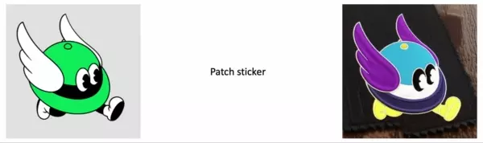
</p>
<p align="center">
  <i>Introducing Greeny, our company's mascot.</i>
</p> 

Official Pytorch implementation of Graphit (**Paper will be published.**)

**[Geonmo Gu](https://geonm.github.io/)<sup>1</sup>, [Sanghyuk Chun](https://sanghyukchun.github.io/home/)<sup>2</sup>, [Wonjae Kim](https://wonjae.kim)<sup>2</sup>, HeeJae Jun<sup>1</sup>, [Sangdoo Yun](https://sangdooyun.github.io)<sup>2</sup>, Yoohoon Kang<sup>1</sup>\***

<sup>1</sup> NAVER Vision <sup>2</sup> NAVER AI Lab

(\* Corresponding author. If you have any buisness inquries, please contact to __yoohoon.kang[at]navercorp[dot]com__)

## ⭐ Overview

**Welcome to Graphit, a novel approach to perform various image editing tasks within a single framework!**

Graphit is a model for editing images through additional training of text to image diffusion models. Of course, text to image functionality is also possible.

Our paper (**to be published soon**) will delve into the details of Graphit's methodology, which combines text-to-image diffusion models like Stable diffusion and unCLIP for a wide range of image editing capabilities.

With Graphit, you can easily edit images using textual or visual guidance, opening up endless possibilities for your creative endeavors.

In this repository, we present the Graphit model applied to Stable diffusion v1.5 and we call it Graphit-SD.

Through a Graphit training method, we can perform various image editing methods in a single model, including:

1. Text to Image
2. Image variations
3. Instruction-based image to image
4. Depth to Image
5. Edge to Image
6. Inpaint
7. Image harmonization
8. Sketch (Rough) to Image
9. Sketch (Detail) to Image
10. Color Sketch to Image
11. How to control options
12. and more...

## 🚀 News

- **04/--/2023** - Graphit-SD model released!

## 🖼️ How to run demo
Users who have experienced to run Stable Diffusion v1.5 on their own commercial GPU can try Graphit-SD by following below steps:

#### Install requirements
```
$ pip install -r requirements.txt
```

Graphit models employ [CompoDiff-Aesthetic](https://github.com/navervision/CompoDiff) as a prior, which is a crucial component.

#### Run the demo
```
$ python demo_editor.py
```

## 🎨 How to use demo
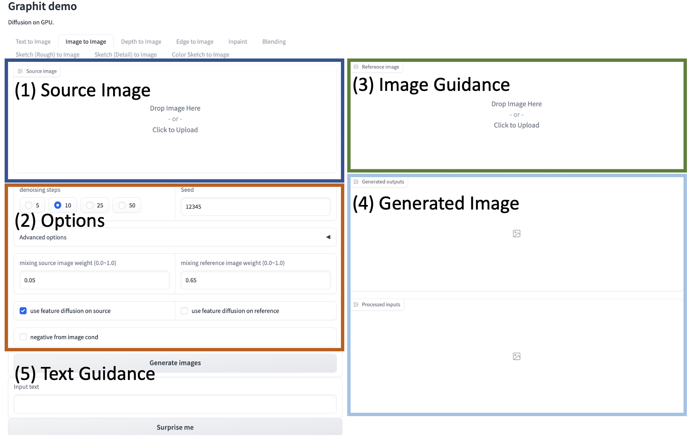

(1) This is the section where you can attach the image you want to modify, excluding text-to-image conversion. Sketch features are provided through the canvas.
(2) We provide various options to enable users to create the desired image.
(3) (Optional) You can attach an image to be used as guidance for image modification.
(4) This section displays the generated images and preprocessed input images.
(5) (Optional) This is the section where you can input text guidance.

## 1. Text to Image
The most basic function is text-to-image generation. You can set the length of the width and height in pixels, and modify negative text in the advanced option.

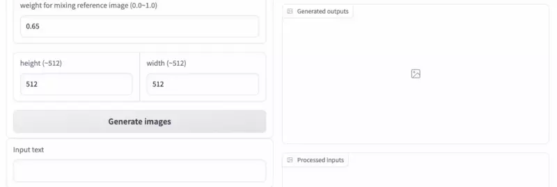

## 2. Image variation
Image variation is included in the Text to Image tab. If you leave the text guidance blank and upload an image in the Image guidance section, you can create various images.

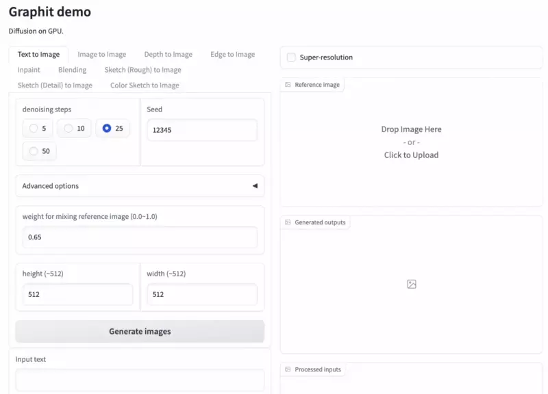

## 3. Image to Image
This is Image to Image feature. If you are familiar with InstructPix2Pix, you can easily use it. First, upload the image to be modified to (1) Source Image section and input a instruction sentence or a sentence to be generated in (5) Text Guidance. The result is as follows.

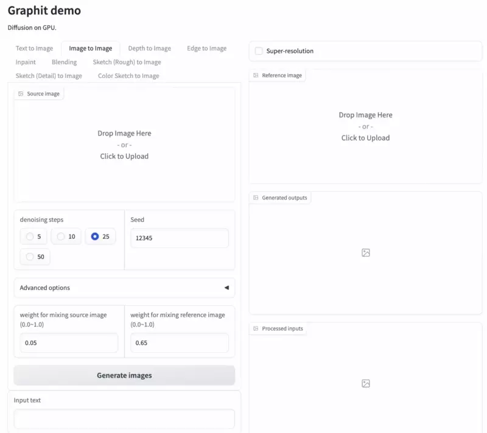

### weight for mixing source image

The weight for mixing source image is a special option included in the Image to Image feature of Graphit. Ideally, the Image to Image feature would always work perfectly, but there are cases where the context of the source image is lost. This is why we added this option to control how much the context is applied.

To solve this problem, we firstly implemented a classifier-free guidance scale to control how much of the source image's context is applied to the output being modified. However, an additional term is required for this, which requires one more forward process to get an unconditional denoised state.

To reduce computational complexity, we simplified the CFG formula and applied the context of the source image through a linear combination of embeddings using CompoDiff in CLIP-L/14's visual embedding space.

The results below show the effect of changing the value of the weight for mixing source image (w_source).

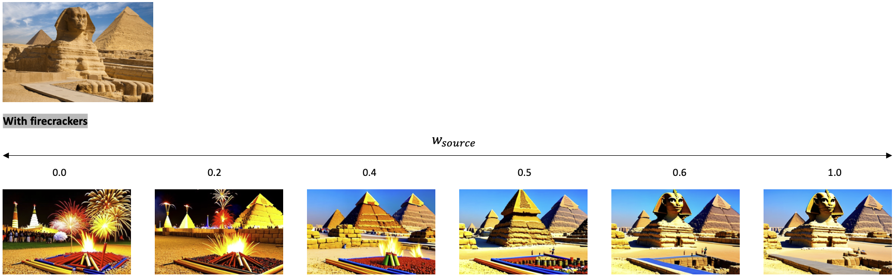

## 4. Depth to Image / 5. Edge to Image
Users familiar with ControlNet are expected to easily use Depth to Image and Edge to Image. The Depth map uses the Midas model, and the Edge map uses the Canny edge map.

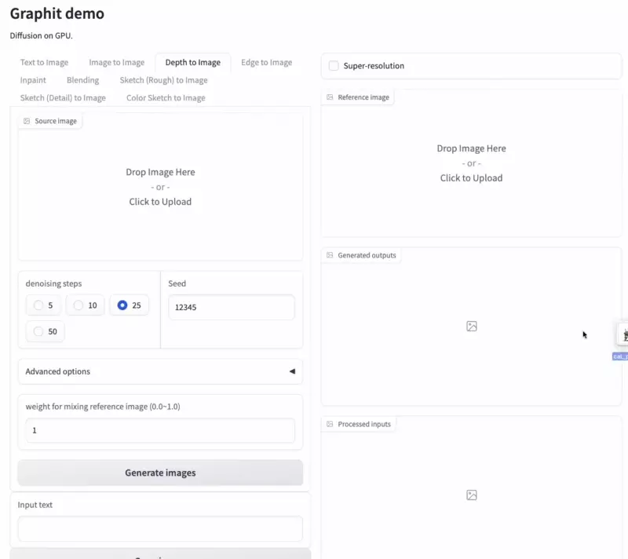

## 6. Inpaint
Upload the image to be modified to (1) Source Image and mask the part to be modified using the masking tool. Our inpainting feature provides reliable results not only for sentence type but also for short object terms.

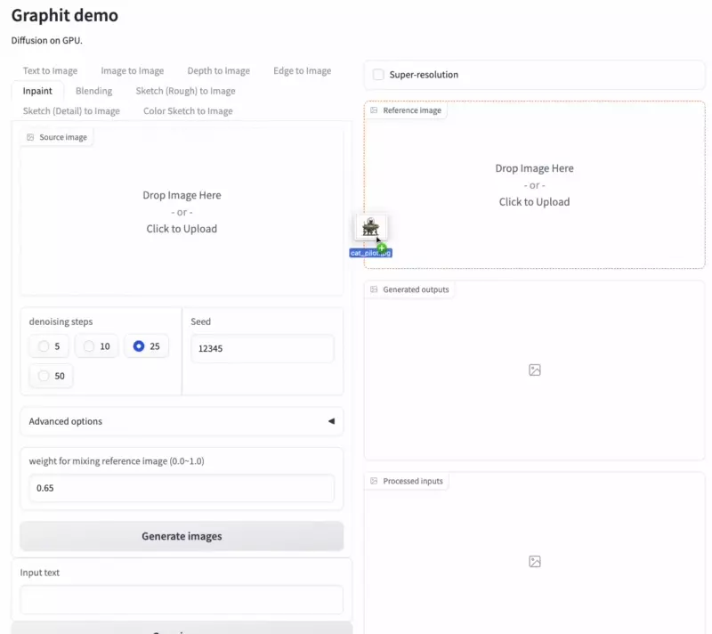

Here, you can also input images instead of text. Below are examples of results for various input texts or images.

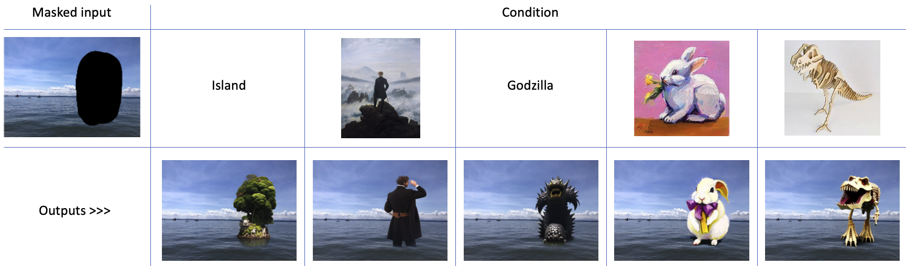

NOTE: Our inpainting feature is trained on an object-by-object basis, so it provides reliable results even for short prompts. Therefore, you no longer need to do prompt engineering to get inpainting results.

## 7. Image harmonization (Blending)
The masking process for this feature is the same as in 6. Inpaint. However, you must attach the image that you want to paste into the (3) Image Guidance.

It is important to note that while a third-party salient object detector is employed to segment only the object in the reference image, it is not a crucial component of Graphit. We use this detector because the Gradio API does not support an editing image tool with a sketch mode.

Sometimes there may be cases where the salient object detector cannot accurately detect the object, resulting in a strange output. You can find the segment result at (4) processed inputs section in the demo. We found that segment anything resolved this issue. We will later switch to the segment anything model to provide a more convenient user experience. To crop the desired part, use the editing tool provided by Gradio, as shown below.

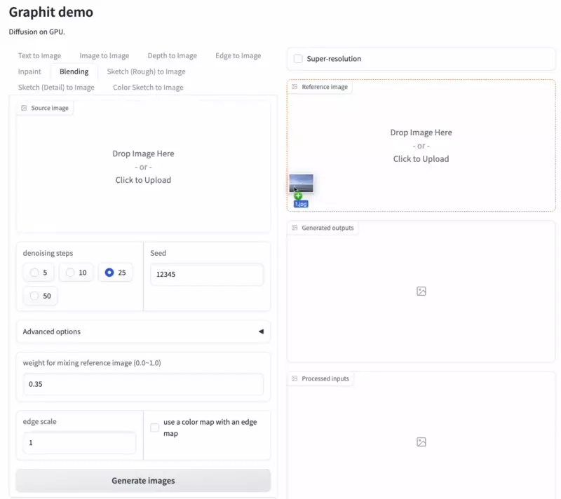

If the `Input text` is empty, basic image harmonization is performed, but by inputting text, more diverse results can be generated as follows.

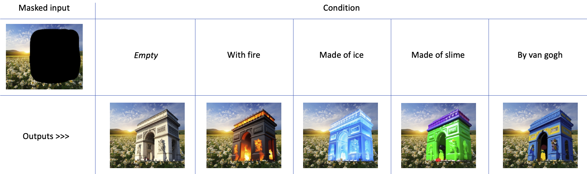

## 8. Sketch (Rough) to Image
We have designed two features specifically for **Sketch to Image** to provide users with a more flexible way to generate images from sketches. ControlNet's Scribble to Image function allows users to input detailed sketches and generate the desired image. However, we understand that users may also want to create simple sketches, such as blobs, to achieve their desired results.

To address this, we have introduced the Sketch (Rough) to Image function. Simply click the Build canvas button to open the canvas and draw a blob. Then, you can use text or image guidance to create your desired image.

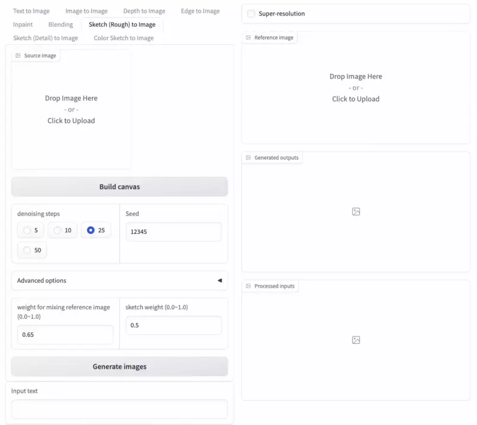

### sketch weight
We propose a controllable `sketch weight` feature for Graphit's sketch-based image generation.
The lower the value of the sketch weight, the more Graphit generates the image not only from the sketch but also from the background.

On the other hand, when the sketch weight is closer to 1, Graphit generates the image mainly from the sketch.
We hope users can create design assets by adjusting the sketch weight. Please refer to the following results for examples.

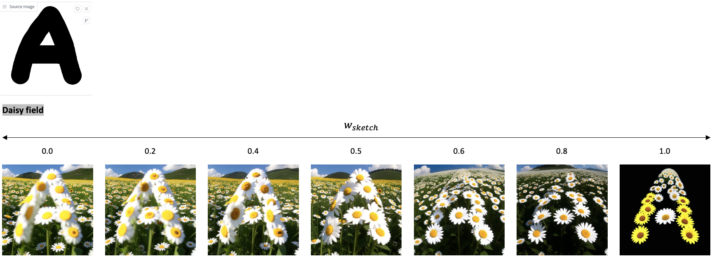

## 9. Sketch (Detail) to Image
Users who are familiar with ControlNet's Scribble to Image are expected to be familiar with this feature as well. Represent the desired image with lines and create the desired image using text or image guidance. We highly recommend not adjusting the width of the brush for best results.

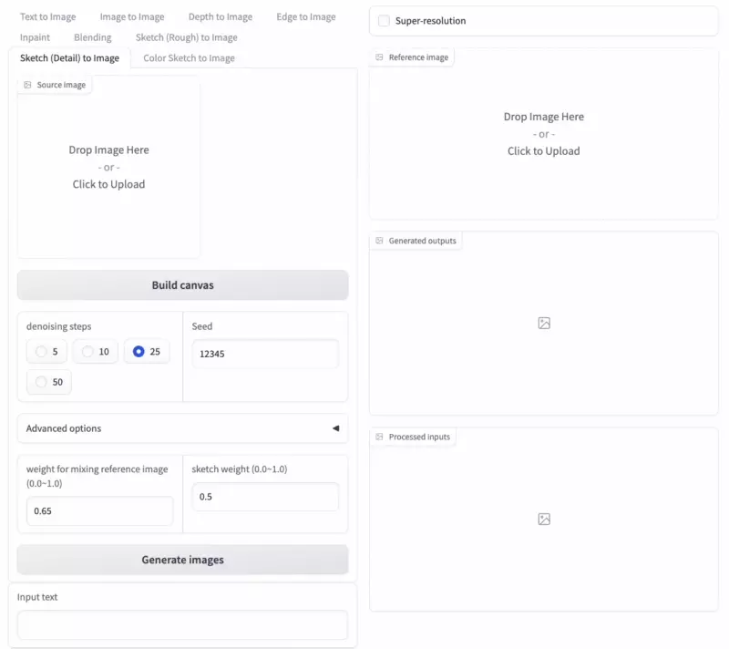

## 10. Color Sketch to Image
We propose the Color Sketch to Image function, which goes a step further. Please refer to the below.

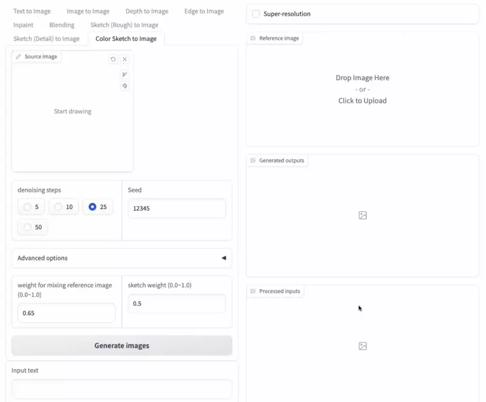

## 11. How to Control options

Here, we will introduce how to use the options that are commonly used in various functions of Graphit. The familiar `denoising steps` is okay at around 25, and 50 takes more time but minimizes artifacts. `Seed` becomes the seed for generating random noise, and if this value is fixed, the generated image will also be fixed. This seed is also applied to compodiff.

### Advanced options
By clicking on `Advanced options`, you can control `attn image space scale`, `attn text scale`, and `Negative text`. Graphit only uses CLIP-L/14 visual embeddings as a generating condition. The CFG scale for these options can be adjusted through `attn image space scale`. `attn text scale` becomes the CFG scale for textual embeddings used in CompoDiff. We recommend using the default value (7.5) for both options.

### Negative visual embeddings
In Graphit, we induce a special and unique CFG for Negative text as follows. First, we generate CLIP-L/14 visual embeddings for Negative text through CompoDiff. We then use these generated Negative visual embeddings as unconditional guidance for the CFG formula. In other words, we can say that we introduced a negative image for the first time.

**Input prompt:** `a photo of a rabbit`

**Negative prompt:** `watermark, longbody, lowres, bad anatomy, bad hands, missing fingers, extra digit, fewer digits, cropped, worst quality, low quality`

with negative visual embeddings | without negative visual embeddings
-- | --
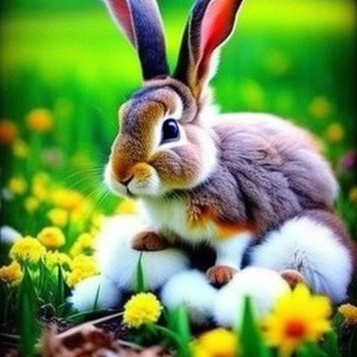 | 

### Weight for mixing reference image
`Weight for mixing reference image` is an option included in all functions. The demo usage shown in this README did not use a reference image except for special cases, but a reference image can be used for all functions because we use Visual embeddings as guidance. We can calculate visual embedding guidance through a weighted linear sum in the reliable embedding space of CLIP-L/14, and `weight for mixing reference image` (w_ref) indicates how much influence the reference image will have. The results below show images generated by adjusting w_ref.

**Text to image example:**


**Sketch (detail) to image example:**
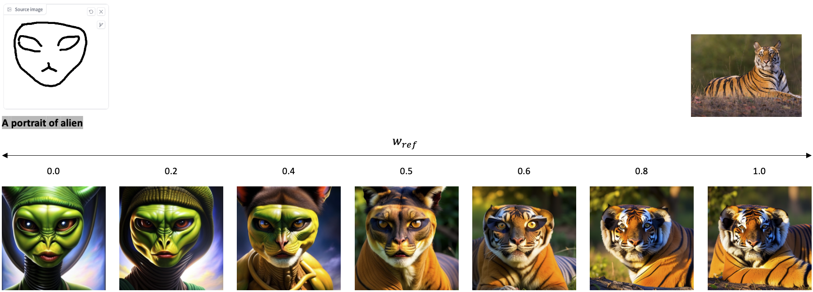

## 12. and More...
Our model provides various functions through preprocessing of the input image. These can be combined, such as Image harmonization, which is performed through a combination of edge to image and inpainting functions.
We hope that community will discover the various functions that Graphit could offer.

#### P.S: We are using a function to modify the color of a specific area of the image in a in-house demo, but we have excluded this function from this release because Gradio API does not yet provide the necessary features for this.

## 📝 Citing Graphit

We will be publishing the Graphit paper as soon as possible. Stay tuned for updates!

---

Give Graphit a star ⭐ on GitHub and share it with your friends and colleagues. With your support, we can continue to innovate and push the boundaries of what's possible in image editing research.
